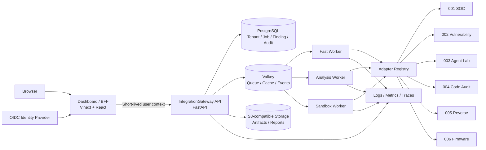

# Longyuan AI Security Agent Suite 技术方案

> 状态：v1.0 实施基线  
> 最近更新：2026-08-05  
> 适用范围：`web-ui`、`000shared-llm-core`、`000shared-integration` 与 001–006 六个安全产品

## 1. 决策摘要

项目继续采用 **模块化单体控制面 + 独立 Worker 执行面**，不立即拆成六套微服务。

- 保留现有 Python/FastAPI、React/Vinext 和六产品 CLI，不更换技术栈。
- Gateway 只负责鉴权、任务编排、统一数据模型、查询和审计，不承载产品业务逻辑。
- 扫描从同步 HTTP 子进程改为异步 Job；Worker 继续复用现有 adapter 和 CLI。
- 生产数据从 SQLite 迁移到 PostgreSQL；SQLite 仅保留本地开发和单机 Demo。
- 使用 Valkey + Celery 承担任务队列、超时、重试和 Worker 路由。
- 浏览器只访问 Dashboard/BFF；用户身份映射到租户和角色后，由服务端调用 Gateway。
- 二进制、固件、报告等大文件进入 S3 兼容对象存储，数据库只存元数据和引用。
- 先交付可靠单实例，再根据真实负载启用多实例、独立队列和 Kubernetes。

这套方案吸收成熟开源项目的稳定模式，但有意避免过早引入 Elasticsearch、知识图谱、端点 Agent 集群和复杂 SOAR。

## 2. 目标与非目标

### 2.1 v1.0 目标

1. 六个产品通过统一 API 创建、查询、取消扫描任务。
2. Finding、Correlation、Artifact、Job 和 AuditEvent 可持久化、可追踪、按租户隔离。
3. 用户、租户、角色、API Key 与审计形成完整身份链路。
4. Dashboard 能展示真实任务进度和实时 Finding，生产环境不静默回退 Demo 数据。
5. 单节点生产部署可备份、恢复、监控和滚动升级。
6. 八仓兼容版本可复现，中央 CI 能测试固定 commit 组合。

### 2.2 暂不实施

- 不把每个产品立即改造成常驻微服务。
- 不引入 Elasticsearch/OpenSearch；PostgreSQL 先满足结构化筛选和全文搜索。
- 不建设 STIX2 知识图谱，只在数据模型中保留来源和关系扩展位。
- 不自研身份提供商；使用 OIDC，保留服务端 API Key 给自动化集成。
- 不在没有真实容量数据前部署 Kubernetes。

## 3. GitHub 类似项目对比

调研快照日期为 2026-08-05。Star 数会变化，只用于衡量社区成熟度，不作为选型依据。

| 项目 | 主要功能 | 架构与技术栈 | 优点 | 缺点 / 不适合照搬 | 本项目借鉴点 |
|---|---|---|---|---|---|
| [DefectDojo](https://github.com/DefectDojo/django-DefectDojo)（约 4.9k Stars，BSD-3-Clause） | 漏洞导入、去重、跟踪、修复、报告、DevSecOps/ASPM | Python/Django + DRF；PostgreSQL；Celery Worker/Beat；Valkey；NGINX/uWSGI | Finding 生命周期和去重成熟；解析器生态丰富；权限、SSO、迁移和部署体系完整 | 领域偏 AppSec；应用单体较重；部分高级能力属于商业版 | Finding 指纹、状态流转、批量导入、数据库迁移、异步后台任务 |
| [IntelOwl](https://github.com/intelowlproject/IntelOwl)（约 4.6k Stars，AGPL-3.0） | IOC/文件分析、情报富化、Analyzer、Connector、Pivot、Playbook、Investigation | Python/Django/DRF；Celery；PostgreSQL；Redis/RabbitMQ/SQS 可选；uWSGI/Daphne；React；分析器可独立容器运行 | 与本项目的“统一请求触发多个分析器”最接近；插件边界清晰；任务队列和多队列成熟 | 运行组件和依赖较多；插件维护成本高；AGPL 对代码复用有约束 | Job 模型、插件注册表、Worker 队列、超时重试、能力声明、分析器隔离 |
| [OpenCTI](https://github.com/OpenCTI-Platform/opencti)（约 9.8k Stars，CE Apache-2.0 / EE 商业许可） | 威胁情报知识管理、STIX2、关系推理、Connector、导入导出、组织隔离 | TypeScript/Node/GraphQL + React；Elasticsearch/OpenSearch；Redis；RabbitMQ；MinIO；Python Worker/Connector；OpenTelemetry | 来源追踪和关系模型强；Connector 契约成熟；组织级数据隔离、RBAC、可观测性完整 | 基础设施重、资源消耗高；图谱和搜索栈超出当前需求；社区版/企业版边界需关注 | 数据来源与证据链、Organization/Role 模型、对象存储、连接器清单、审计和可观测性 |
| [Wazuh](https://github.com/wazuh/wazuh)（约 16.4k Stars，GPLv2） | XDR/SIEM、日志分析、漏洞检测、FIM、配置检查、主动响应 | C/C++ 数据面；Python/Starlette API；JWT/RBAC；Manager 多进程；Unix Socket/Router；Wazuh Indexer；Dashboard；多节点集群 | 高吞吐数据面、进程隔离、健康检查、RBAC 和集群职责边界清楚 | 体系庞大且偏端点/SIEM；低层多进程和 Agent 运维不适合当前规模 | 控制面/执行面分离、最小公开健康信息、任务状态、内部通信边界、故障隔离 |

### 3.1 官方依据

- DefectDojo 官方[系统架构](https://github.com/DefectDojo/django-DefectDojo/blob/master/docs/content/get_started/open_source/architecture.md)明确使用 PostgreSQL、Celery 和 Valkey；官方 [Docker Compose](https://github.com/DefectDojo/django-DefectDojo/blob/master/docker-compose.yml)展示 Web、Worker、Beat、Initializer 和数据库分工。
- IntelOwl 官方 [README](https://github.com/intelowlproject/IntelOwl/blob/master/README.md)定义 Analyzer、Connector、Pivot、Visualizer、Ingestor、Playbook 和统一数据模型；[默认 Compose](https://github.com/intelowlproject/IntelOwl/blob/master/docker/default.yml)将 Web、WebSocket、Celery Worker 与定时任务分开。
- OpenCTI 官方 [README](https://github.com/OpenCTI-Platform/opencti/blob/master/README.md)说明 STIX2、GraphQL、Connector 和关系推理；[开发部署清单](https://github.com/OpenCTI-Platform/opencti/blob/master/opencti-platform/opencti-dev/docker-compose.yml)展示搜索、消息队列、对象存储和遥测组件；[组织隔离文档](https://github.com/OpenCTI-Platform/opencti/blob/master/docs/docs/administration/organization-segregation.md)提供组织和数据隔离思路。
- Wazuh 官方[架构文档](https://github.com/wazuh/wazuh/blob/main/docs/ref/architecture.md)描述 Manager 多进程、Router、Indexer、API、JWT/RBAC 和集群职责。

## 4. 取舍结论

### 4.1 直接采用

1. **DefectDojo：Finding 生命周期**  
   Finding 增加稳定 fingerprint、首次/最后发现时间、出现次数、状态、负责人和处置记录，导入相同问题时更新而不是重复创建。

2. **IntelOwl：异步分析器编排**  
   Gateway 创建 Job，Celery Worker 调用 adapter；每个 adapter 声明输入 schema、超时、并发数、队列和能力。

3. **OpenCTI：来源与证据链**  
   Finding 必须关联 Job、产品、原始 Artifact、规则/模型版本和生成时间；Correlation 保存规则版本和参与 Finding。

4. **Wazuh：控制面与执行面分离**  
   API 进程不直接承担长扫描；公开存活检查与内部详细健康信息分开；Worker 故障不得拖垮 Gateway。

### 4.2 延后采用

- 按任务类型拆队列，而不是立即按六产品拆微服务：`fast`、`analysis`、`sandbox`。
- PostgreSQL 全文搜索先覆盖标题、主机、CVE、资产和证据；数据量证明不足后再评估 OpenSearch。
- 关联关系先用关系表，不上图数据库；跨产品规则稳定后再评估图查询。
- 单机 Compose 先上线；需要水平扩展时再使用托管容器或 Kubernetes。

### 4.3 明确不采用

- 不复制 AGPL/GPL 项目代码，只参考公开架构模式和接口思想。
- 不把产品代码合并进 Gateway。
- 不让 Dashboard 持有长期租户 Token。
- 不在生产故障时展示伪造 Demo Finding。

## 5. 目标架构



### 5.1 组件职责

| 组件 | 职责 | 不负责 |
|---|---|---|
| Dashboard/BFF | 登录会话、页面、服务端 API 代理、租户上下文、用户可见错误 | 保存长期 Gateway Token、直接运行扫描器 |
| IntegrationGateway API | 鉴权、RBAC、参数校验、Job 创建、查询、审计、SSE | 执行长时间产品扫描、存储大文件内容 |
| Worker | 获取 Job、准备 Artifact、调用 adapter、上报进度、超时/取消、规范化结果 | 用户登录、页面渲染、跨租户查询 |
| Adapter Registry | 产品能力、输入 schema、CLI 命令、超时、队列、版本兼容 | 产品业务判断、Finding 展示逻辑 |
| PostgreSQL | 事务数据、租户关系、任务、Finding、Correlation、审计 | 大型样本和报告二进制 |
| Valkey | Celery broker、短期缓存、进度事件、限流 | 最终事实数据 |
| S3 兼容存储 | 上传样本、固件、报告、原始输出；按租户前缀隔离 | 权限决策、结构化查询 |

## 6. 技术栈

| 层 | 选型 | 说明 |
|---|---|---|
| Web | 现有 Vinext、React 19、TypeScript、Playwright | 保持现状，补登录、任务和错误状态 |
| API | Python 3.12、FastAPI、Pydantic、Uvicorn | 复用 IntegrationGateway，新增 `/v1` |
| Worker | Celery 5 + Valkey | 借鉴 DefectDojo/IntelOwl；提供重试、超时、调度和队列路由 |
| Database | PostgreSQL 16+、SQLAlchemy 2、Alembic | 结构化查询、事务和迁移；保留 Repository 抽象 |
| Artifact | S3 API；本地开发可用 MinIO | 样本、固件和报告不进入数据库 |
| Identity | OIDC 用户登录 + 哈希化 scoped API Key | 用户和机器身份分开；JWT 短期有效 |
| Events | 先使用 Valkey Pub/Sub + SSE | 浏览器仍只连接 Dashboard；后续可替换为持久化 Stream |
| Observability | JSON 日志、Prometheus 指标、OpenTelemetry trace | 所有事件带 request/job/tenant/source ID |
| Deployment | OCI 镜像 + Docker Compose 单节点 | 达到容量门槛后再水平扩展或上 K8s |

## 7. 核心数据模型

所有业务表必须显式包含 `tenant_id`，所有唯一约束必须考虑租户边界。

| 实体 | 关键字段 |
|---|---|
| Tenant | `id`, `slug`, `name`, `status`, `retention_days` |
| User | `id`, `issuer`, `subject`, `email`, `display_name` |
| Membership | `tenant_id`, `user_id`, `role` |
| ApiKey | `tenant_id`, `key_prefix`, `secret_hash`, `scopes`, `expires_at`, `revoked_at` |
| Job | `tenant_id`, `source`, `status`, `queue`, `input`, `progress`, `timeout_at`, `created_by`, `idempotency_key` |
| JobEvent | `tenant_id`, `job_id`, `sequence`, `kind`, `payload`, `created_at` |
| Artifact | `tenant_id`, `sha256`, `size`, `media_type`, `storage_key`, `created_by` |
| Finding | `tenant_id`, `fingerprint`, `source`, `severity`, `confidence`, `status`, `asset`, `cve`, `first_seen`, `last_seen`, `occurrences`, `job_id`, `artifact_id` |
| Correlation | `tenant_id`, `rule_id`, `rule_version`, `severity`, `narrative`, `created_at` |
| CorrelationFinding | `tenant_id`, `correlation_id`, `finding_id` |
| AuditEvent | `tenant_id`, `actor`, `action`, `resource_type`, `resource_id`, `request_id`, `outcome`, `created_at` |

最低索引：

- `Finding(tenant_id, fingerprint)` 唯一索引；
- `Finding(tenant_id, severity, last_seen desc)`；
- `Finding(tenant_id, source, last_seen desc)`；
- `Job(tenant_id, status, created_at desc)`；
- `JobEvent(tenant_id, job_id, sequence)` 唯一索引；
- `AuditEvent(tenant_id, created_at desc)`。

## 8. API 方案

保留 `/v0.5` 读取接口一个迁移周期，新功能进入 `/v1`。

| 方法 | 路径 | 权限 | 用途 |
|---|---|---|---|
| `POST` | `/v1/scans` | analyst/admin | 创建 Job，支持 `Idempotency-Key` |
| `GET` | `/v1/scans/{job_id}` | viewer+ | 查询状态和进度 |
| `POST` | `/v1/scans/{job_id}/cancel` | analyst/admin | 取消排队或运行任务 |
| `GET` | `/v1/scans/{job_id}/events` | viewer+ | 任务事件流 |
| `GET` | `/v1/findings` | viewer+ | 游标分页和结构化筛选 |
| `PATCH` | `/v1/findings/{finding_id}` | analyst/admin | 分派、确认、关闭、误报 |
| `GET` | `/v1/correlations` | viewer+ | 跨产品关联查询 |
| `POST` | `/v1/artifacts` | analyst/admin | 预签名上传或受控上传 |
| `GET` | `/livez` | public | 仅判断 API 进程存活 |
| `GET` | `/readyz` | platform | 检查数据库、队列和 Worker |
| `GET` | `/v1/admin/health` | admin | 详细产品/Worker 健康信息 |

统一错误格式：

```json
{
  "error": {
    "code": "ADAPTER_TIMEOUT",
    "message": "Firmware analysis exceeded its time limit",
    "request_id": "req_...",
    "job_id": "job_...",
    "retryable": true
  }
}
```

## 9. Adapter 与任务执行契约

每个产品 adapter 提供：

```python
class ProductAdapter(Protocol):
    source: FindingSource
    version: str
    queue: Literal["fast", "analysis", "sandbox"]
    timeout_seconds: int
    max_concurrency: int

    def capabilities(self) -> AdapterCapabilities: ...
    def validate(self, payload: dict) -> ValidatedInput: ...
    async def run(self, context: JobContext, payload: ValidatedInput) -> AsyncIterator[AdapterEvent]: ...
    async def health(self) -> AdapterHealth: ...
```

执行要求：

- 输入通过 stdin 或只读临时文件传递，不能放入进程命令行参数。
- 每个 Job 都有硬超时、优雅终止时间和最终强制终止。
- stdout/stderr、上传体积和输出 Finding 数量有上限。
- Worker 必须显式绑定 `tenant_id`，不能只依赖请求 ContextVar。
- 相同 `tenant_id + idempotency_key` 不重复执行。
- 重试只覆盖临时故障；输入错误、CLI 不存在、策略拒绝不重试。
- 每个 Finding 必须携带 Job、adapter 版本和原始证据引用。

## 10. 多租户与 RBAC

### 10.1 角色

| 角色 | 权限 |
|---|---|
| viewer | 查看本租户 Job、Finding、Correlation 和报告 |
| analyst | viewer + 创建/取消扫描、处置 Finding、上传 Artifact |
| admin | analyst + 成员、API Key、保留策略和集成配置管理 |

### 10.2 防线

1. Dashboard/BFF 从可信 OIDC 会话获得用户身份。
2. Gateway 根据 Membership 计算租户和角色，不信任浏览器提交的 `tenant_id`。
3. Repository 层所有方法必须接收显式 tenant，不允许无租户查询。
4. PostgreSQL 可在多实例阶段增加 RLS 作为第二道防线。
5. API Key 只保存哈希和前缀，支持 scope、过期、轮换和吊销。
6. 管理、扫描、导出、处置和鉴权失败全部写入不可变 AuditEvent。

## 11. 前端方案

- 生产环境 `GATEWAY_URL` 缺失或请求失败时显示明确错误，不加载 Demo Finding。
- Demo 数据只允许 `APP_MODE=demo` 的开发/展示部署。
- 增加任务列表、任务详情、进度、取消、失败原因和重试入口。
- SSE 只给建连阶段设置超时；连接成功后保持长连接并实现指数退避重连。
- Finding 事件必须更新客户端缓存，而不是只增加事件计数。
- Dashboard/BFF 根据用户会话调用 Gateway，不使用全局长期租户 Token。
- Playwright 同时覆盖 Demo 和真实 Gateway：登录、租户隔离、401/403、任务生命周期、SSE、网关故障。

## 12. 部署与可观测性

### 12.1 v1.0 单节点拓扑

```text
HTTPS Ingress
├── Dashboard/BFF
└── IntegrationGateway API
    ├── PostgreSQL
    ├── Valkey
    ├── Worker: fast
    ├── Worker: analysis
    ├── Worker: sandbox
    └── S3/MinIO（有文件型任务时启用）
```

- API 与 Worker 使用同一个版本镜像、不同启动命令，避免重复打包六套依赖。
- Worker 使用非 root、只读根文件系统、独立临时目录和资源限制。
- Sandbox 队列必须部署到隔离程度更高的 Worker，不与 Gateway 共容器。
- 数据库每日备份并执行定期恢复演练；Artifact 使用生命周期和保留策略。
- `/livez` 不暴露路径、版本细节或租户统计；`/readyz` 只供平台探针。

### 12.2 关键指标

- API：请求率、P50/P95/P99、4xx/5xx、鉴权失败、限流次数。
- Job：排队时间、执行时间、成功率、超时率、取消率、按 source/tenant 分类。
- Worker：在线数、并发、队列深度、子进程退出码、内存和磁盘使用。
- Data：Finding 写入率、去重率、Correlation 命中率、数据库慢查询。
- SSE：连接数、断线率、事件延迟和丢弃数。

## 13. CI/CD 与多仓版本治理

1. 每个仓库保留自己的单元测试、Lint 和类型检查。
2. 中央 suite CI 使用 `suite-lock.yml` 固定八仓 commit 和包路径。
3. 产品仓 PR 通过 `repository_dispatch` 传递自己的候选 SHA，其他仓使用锁定 SHA。
4. 构建阶段验证六个真实 CLI envelope、Gateway API、PostgreSQL/Valkey 和 Playwright live E2E。
5. 镜像生成 SBOM，执行依赖审计、Secret 扫描和容器漏洞扫描。
6. 只有通过兼容套件的 commit 组合才能生成版本标签和镜像。
7. 生产部署使用不可变镜像 digest，保留数据库迁移和回滚步骤。

## 14. 分阶段实施计划

> 实施状态（2026-08-05）：M0/M1 代码已落地并通过单元、API、真实 SOC
> adapter 与 Celery task 入口验证；中央锁定版本 CI 已转入
> `000shared-llm-core/suite-lock.yml`。实际 Valkey broker 联调和六产品完整
> CLI 套件仍是 M1 发布门禁，M2–M5 尚未开始。

### M0：契约与迁移准备

- 新增 `/v1` OpenAPI、Job 状态机、错误码和 AdapterCapabilities。
- 建立 `suite-lock.yml` 和架构 ADR。
- 为现有 `/v0.5` 增加弃用说明，不破坏 Dashboard 读取。

**验收**：API/数据模型评审通过；六产品输入输出契约测试通过。

### M1：异步执行面

- 引入 Celery + Valkey。
- Gateway 创建 Job；Worker 调用六个现有 adapter。
- 实现 timeout、cancel、retry、并发限制、幂等和三类队列。
- 先使用现有 SQLite JobRepository 测试，隔离任务系统改动。

**验收**：六产品均能完成 queued → running → succeeded/failed/cancelled；故障 Worker 不影响 API；超时子进程可被回收。

### M2：PostgreSQL、Finding 生命周期与多租户

- 实现 SQLAlchemy Repository 和 Alembic 迁移。
- 创建 Tenant/User/Membership/ApiKey/Job/Finding/AuditEvent 表。
- 实现 Finding fingerprint、去重、状态流转、游标分页。
- 从 SQLite 提供一次性导入工具并验证备份恢复。

**验收**：租户隔离自动化测试覆盖所有 Repository/API；重复 Finding 正确合并；迁移可升级和回滚。

### M3：身份与真实前端工作流

- 接入 OIDC/BFF 会话，保留 scoped API Key 给机器调用。
- Dashboard 增加 Job 页面、真实进度、错误状态、处置流程。
- 修复生产 Demo 回退和 SSE 生命周期。
- Playwright 启动真实 Gateway/PostgreSQL/Valkey 测试多租户和 RBAC。

**验收**：viewer/analyst/admin 权限矩阵通过；跨租户访问全部拒绝；网关离线时不显示伪造数据。

### M4：生产交付

- 生成单节点 Compose 和生产镜像。
- 接入 HTTPS、Secret Manager、备份、指标、日志和 Trace。
- 补齐八仓固定版本 CI、SBOM、安全扫描和公网 E2E。
- 执行容量、故障恢复和回滚演练。

**验收**：公开 HTTPS 环境连续运行；备份可恢复；Worker 故障可降级；核心告警可触发。

### M5：按真实负载扩展

只有出现以下信号才进入本阶段：单队列长期堆积、数据库查询无法满足 SLA、单节点资源隔离不足或客户要求高可用。

- 独立扩缩 `fast/analysis/sandbox` Worker。
- PostgreSQL 高可用与连接池；Valkey 高可用。
- SSE 事件改为可恢复 Stream。
- 需要全文检索时再引入 OpenSearch。
- 需要跨大量关系查询时再评估图存储。
- 有明确多节点运维需求后再部署 Kubernetes。

## 15. 风险与控制

| 风险 | 控制 |
|---|---|
| Celery/Valkey 增加运维组件 | 仅在 M1 引入；提供 Compose、健康检查和故障测试 |
| 六产品依赖冲突导致单镜像膨胀 | 中期按 Worker 队列拆镜像；suite-lock 固定兼容版本 |
| 长任务占满 CPU/内存/磁盘 | 租户配额、Worker 并发、容器资源限制、Artifact 上限 |
| ContextVar 在后台任务中丢失租户 | Job 和 Repository 显式传递 tenant_id |
| Demo 数据掩盖生产故障 | 生产 fail-closed；Demo 使用独立部署模式 |
| 复制开源项目带来许可问题 | 只借鉴模式；代码复用前逐项审核 BSD/Apache/AGPL/GPL 许可 |
| 过早建设重型平台 | 每个扩展组件都有容量/客户需求触发条件 |

## 16. 下一步

完成 M1 发布门禁：在真实 Valkey 上验证三类 Worker 队列及六产品
queued → terminal 全链路，然后进入 M2 的 PostgreSQL、租户实体、Finding
生命周期与审计事件。M3 再接 OIDC/BFF、真实 Dashboard 工作流和 Playwright
多租户/RBAC E2E，避免在持久化边界尚未稳定时重做前端权限模型。
